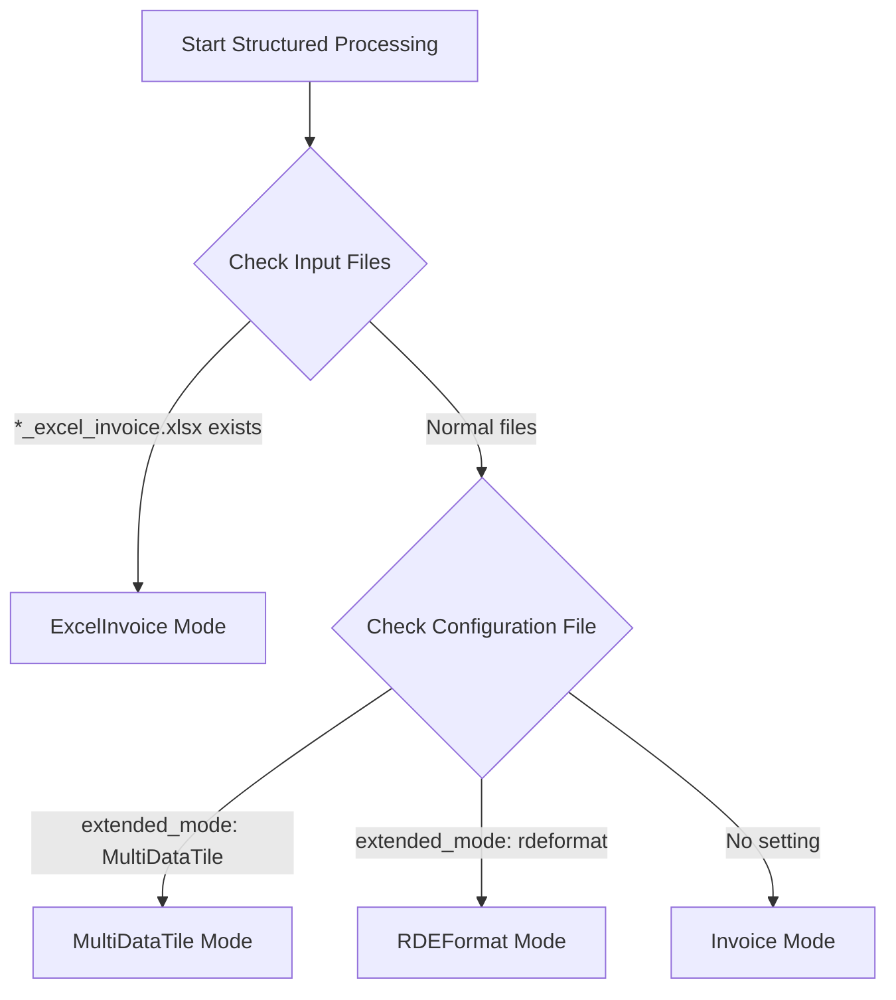

# What are Data Registration Modes

## Purpose

This document explains the four data registration modes in RDE structured processing. You will understand the characteristics, use cases, and configuration methods of each mode to select the appropriate mode.

## Challenges and Background

Research data registration had diverse needs such as:

- **Single Dataset**: Register one experimental result
- **Batch Registration**: Efficiently register multiple related experiments
- **Integrated Management**: Manage related data as one dataset
- **Data Migration**: Migrate existing RDE format data

Four data registration modes were developed to address these diverse needs.

## Key Concepts

### Mode Selection Mechanism



### Four Mode Overview

| Mode | Purpose | Activation Condition | Multiple Data Support |
|------|---------|---------------------|----------------------|
| **Invoice** | Single dataset registration | Default | ✗ |
| **ExcelInvoice** | Batch registration | `*_excel_invoice.xlsx` exists | ✓ |
| **MultiDataTile** | Integrated management | Configuration file specification | ✓ |
| **RDEFormat** | Data migration | Configuration file specification | ✓ |

## Mode Details

### 1. Invoice Mode (Standard Mode)

**Overview**: The most basic data registration mode for registering single datasets.

**Activation Condition**: Activated by default.

**Features**:
- Single dataset registration
- Simple configuration
- Recommended for beginners

**Directory Structure**:
```
data/
├── inputdata/          # Input data
├── invoice/            # Invoice data
│   └── invoice.json
└── tasksupport/        # Support files
    ├── invoice.schema.json
    └── metadata-def.json
```

### 2. ExcelInvoice Mode

**Overview**: Mode for batch registration of multiple datasets using Excel files.

**Activation Condition**: Automatically activated when files with `*_excel_invoice.xlsx` naming convention exist in input files.

**Features**:
- Batch registration of multiple datasets
- Efficient management via Excel files
- Suitable for batch processing

**Directory Structure**:
```
data/
├── inputdata/
│   └── experiment_excel_invoice.xlsx  # Excel invoice file
├── invoice/
└── tasksupport/
```

### 3. MultiDataTile Mode

**Overview**: Mode for integrated management of multiple related data tiles as one dataset.

**Activation Condition**: Must specify `extended_mode: 'MultiDataTile'` in configuration file.

**Configuration Example**:
```yaml
system:
    extended_mode: 'MultiDataTile'
```

**Features**:
- Integrated management of multiple data tiles
- Maintains relationships between data
- Suitable for large-scale datasets

### 4. RDEFormat Mode

**Overview**: Mode for migrating existing RDE format data or creating mocks.

**Activation Condition**: Must specify `extended_mode: 'rdeformat'` in configuration file.

**Configuration Example**:
```yaml
system:
    extended_mode: 'rdeformat'
```

**Features**:
- Migration of existing data
- Mock creation of RDE format data
- Data conversion processing

## Mode Comparison

| Mode | Multiple Data | Configuration Required | Use Case | Difficulty |
|------|---------------|----------------------|----------|------------|
| Invoice | ✗ | ✗ | Single dataset | Beginner |
| ExcelInvoice | ✓ | ✗ | Batch registration | Intermediate |
| MultiDataTile | ✓ | ✓ | Integrated management | Advanced |
| RDEFormat | ✓ | ✓ | Data migration | Advanced |

## Implementation Examples

### Invoice Mode

```python
def dataset(srcpaths: RdeInputDirPaths, resource_paths: RdeOutputResourcePath):
    # Process single dataset
    input_file = list(srcpaths.inputdata.glob("*.csv"))[0]
    df = pd.read_csv(input_file)
    
    # Save processing results
    output_path = resource_paths.structured / "processed_data.csv"
    df.to_csv(output_path, index=False)
```

### MultiDataTile Mode

```python
def dataset(srcpaths: RdeInputDirPaths, resource_paths: RdeOutputResourcePath):
    # Process multiple files
    input_files = list(srcpaths.inputdata.glob("*.csv"))
    
    for i, file in enumerate(input_files):
        df = pd.read_csv(file)
        
        # Save to directory for each tile
        tile_dir = resource_paths.structured / f"tile_{i+1:04d}"
        tile_dir.mkdir(exist_ok=True)
        
        output_path = tile_dir / f"processed_{file.name}"
        df.to_csv(output_path, index=False)
```

## Configuration File Mode Specification

### rdeconfig.yaml

```yaml
system:
    # Standard mode (default)
    extended_mode: null
    
    # MultiDataTile mode
    extended_mode: 'MultiDataTile'
    
    # RDEFormat mode
    extended_mode: 'rdeformat'
```

### pyproject.toml

```toml
[tool.rdetoolkit.system]
extended_mode = "MultiDataTile"
```

## Troubleshooting

### Common Problems

1. **Unintended mode activation**
   - Check input file names (existence of `*_excel_invoice.xlsx`)
   - Check `extended_mode` in configuration file

2. **MultiDataTile mode not activating**
   - Verify `extended_mode: 'MultiDataTile'` is written in configuration file
   - Check if configuration file YAML format is correct

3. **Divided directory not created**
   - Verify MultiDataTile mode or ExcelInvoice mode is correctly activated
   - Check if multiple input data exist

## Related Information

To learn more about data registration modes, refer to the following documents:

- Learn configuration methods in [Configuration Files](config.en.md)
- Check directory roles in [Directory Structure](../structured_process/directory.en.md)
- Understand processing flows in [Structured Processing Concepts](../structured_process/structured.en.md)
