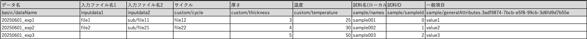

# What is SmartTableInvoice Mode?

## Purpose

A mode that reads metadata from table files (Excel/CSV/TSV) and automatically generates an `invoice.json` file.

## Features

- Multi-format support: reads Excel (.xlsx), CSV, and TSV files
- Two-row header format: row 1 for display names, row 2 for mapping keys
- Automatic metadata mapping: generates structured data using the `basic/`, `custom/`, and `sample/` prefixes
- ZIP integration: automatically associates a ZIP that contains data files with the table file

## When to Use

- When you want to register multiple data items by linking multiple files

## How to Configure

No changes to the configuration file are required. However, you must place Excel/CSV/TSV files whose names begin with the `smarttable_` prefix in the input data.

- `smarttable_tabledata.xlsx`
- `smarttable_imagedata.csv`
- `smarttable_20250101.tsv`

## Table Data Format

### Overview

```csv
# Row 1: Display names (user-facing descriptions)
データ名,入力ファイル1,サイクル,厚さ,温度,試料名,試料ID,一般項目

# Row 2: Mapping keys (used in actual processing)
basic/dataName,inputdata1,custom/cycle,custom/thickness,custom/temperature,sample/names,sample/sampleId,sample/generalAttributes.3adf9874-7bcb-e5f8-99cb-3d6fd9d7b55e

# Row 3 and onward: Data
実験1,file1.txt,1,2mm,25,sample001,S001,value1
実験2,file2.txt,2,3mm,30,sample002,S002,value2
```



### Row 1: Display Names (User-Facing Descriptions)

This row is not used for data registration; it is for making the table easier to understand when managing it.

```csv
データ名,入力ファイル1,サイクル,厚さ,温度,試料名,試料ID,一般項目
```

### Row 2: Mapping Keys

#### Metadata Mapping and Expansion

This row is read and automatically mapped to `invoice.json` and metadata. The mapping rules are as follows:

- `basic/<key in invoice.json>`: mapped to the `basic` section of `invoice.json`.
- `custom/<key in invoice.json>`: mapped to the `custom` section of `invoice.json`.
- `sample/<key in invoice.json>`: mapped to the `sample` section of `invoice.json`.
- `sample/generalAttributes.<termId>`: mapped to the `value` of the matching `termId` in the `generalAttributes` array.
- `sample/specificAttributes.<classId>.<termId>`: mapped to the `value` of the matching `classId` and `termId` in the `specificAttributes` array.
- `meta/<metadata-def key>`: written to the `constant` section of `metadata.json` according to `metadata-def.json` (values are cast using `schema.type`, and `unit` is copied when provided). Entries marked with `variable` are not supported at this time. If `metadata-def.json` is absent, the meta columns are skipped as before.
- `inputdataX`: specifies a file path inside the ZIP file (X = 1, 2, 3, …).

> Currently, table data is automatically expanded into `invoice.json` and `metadata.json` (for `meta/` columns). Other data is exposed so it can be used by the structured processing.

#### About Input File Handling

The key `inputdata[number]` is for entering the file paths you want to include in a single data tile. Specify paths inside the ZIP file.

- For example, if you put `data1/file1.txt` in `inputdata1`, `file1.txt` must exist inside the ZIP file.
- If you put `data1/file1.txt` in `inputdata1` and `data1/file2.txt` in `inputdata2`, they will be grouped so that both files can be read within the structured processing.

### Row 3 and Onward

Enter the actual data to register. Each row is registered as one data tile.

```csv
実験1,file1.txt,1,2mm,25,sample001,S001,value1
実験2,file2.txt,2,3mm,30,sample002,S002,value2
```

### File Extensions

The table data file must have one of the following extensions: `.csv`, `.xlsx`, or `.tsv`.

## About the Input Files

SmartTableInvoice mode requires specific input files: an Excel/CSV/TSV file containing the table data and a ZIP file containing the related data files.

- `smarttable_imagedata.csv`
- `inputdata.zip`

## Directory Structure

Place the Excel file and the ZIP file in the `inputdata` directory.

```bash
data/
├── inputdata/
│   ├── inputdata.zip
│   └── smarttable_imagedata.csv
├── invoice/
├── tasksupport/
```

```bash
data/
├── inputdata/
│   ├── smarttable_imagedata.csv
│   └── inputdata.zip
├── invoice/
├── tasksupport/
├── divided/
│   ├── 0001/
│   │   ├── invoice/
│   │   │   └── invoice.json  # generated from smarttable row 1
│   │   ├── raw/
│   │   │   ├── file1.txt
│   │   │   └── file2.txt
│   │   └── (other standard folders)
│   └── 0002/
│       ├── invoice/
│       │   └── invoice.json  # generated from smarttable row 2
│       └── (other standard folders)
└── temp/
    ├── fsmarttable_experiment_0001.csv
    └── fsmarttable_experiment_0002.csv
```

## Retrieving a Single Row of Table Data in Structuring Processing

If you define the structured processing as shown below, you can obtain the CSV path from `RdeOutputResourcePath.rawfiles`. In the example directory structure above, this would be `temp/fsmarttable_experiment_0001.csv`, etc.

```python
def custom_module(srcpaths: RdeInputDirPaths, resource_paths: RdeOutputResourcePath) -> None:
    """Execute structured text processing, metadata extraction, and visualization.

    It handles structured text processing, metadata extraction, and graphing.
    Other processing required for structuring may be implemented as needed.

    Args:
        srcpaths (RdeInputDirPaths): Paths to input resources for processing.
        resource_paths (RdeOutputResourcePath): Paths to output resources for saving results.

    Returns:
        None

    Note:
        The actual function names and processing details may vary depending on the project.
    """
    ...
```

## Registering the Table Data File with RDE

By default, the table data used by SmartTableInvoice mode is --not-- registered in RDE. You can register the table data in RDE by adding the following setting to the `rdeconfig.yml` configuration file.

```yaml
smarttable:
    save_table_file: true
```

## Automatic Sample Field Clearing Rule (New Sample Registration)

SmartTableInvoice mode generates each row's `invoice.json` by starting from the original `invoice.json` and then partially overwriting it with the row values. As a result, if no `sample` columns are supplied, the sample information from the original invoice remains as-is.

Given that behavior, when the `sample/names` column is specified **and** `sample/sampleId` does not contain a valid value, the row is treated as an intentional **new sample registration**. In that case, dummy sample fields inherited from the original `invoice.json` are automatically cleared.

### Decision Rules

| SmartTable input | Interpretation | Behavior |
|------------------|----------------|----------|
| `sample/names` only | New sample registration | Clear inherited dummy sample fields |
| `sample/names` + empty `sample/sampleId` | New sample registration | Same clearing behavior as missing `sample/sampleId` |
| `sample/names` + non-empty `sample/sampleId` | Existing sample reference | Do not run new-sample clearing |
| No `sample/names` | No sample-registration intent | Preserve sample fields from the original `invoice.json` |

> A `sample/sampleId` cell that contains only whitespace is also treated as missing.

### Fields Cleared

| Field | Value After Clearing | Notes |
|-------|---------------------|-------|
| `sample.sampleId` | `""` (empty string) | Indicates a new sample |
| `sample.description` | `null` | Resets dummy sample description |
| `sample.composition` | `null` | Resets dummy sample composition |
| `sample.referenceUrl` | `null` | Resets dummy sample reference URL |
| `sample.generalAttributes[*].value` | `null` | Structure (termId) is preserved; only values are cleared |
| `sample.specificAttributes[*].value` | `null` | Structure (classId+termId) is preserved; only values are cleared |
| `sample.ownerId` | Set from `basic.dataOwnerId` | Existing rule (Issue #389) continues to apply |

### Interaction with Blank Cells

In fixed-header SmartTable files, columns such as `sample/sampleId`, `sample/description`, or `sample/generalAttributes.<termId>` may always exist while individual cells are left blank.

When the row is interpreted as a new sample registration, those blank columns still preserve the normalized empty structure:

- `sample.sampleId` is kept as `""` instead of removing the key
- `sample.description`, `sample.composition`, and `sample.referenceUrl` are kept as `null`
- `sample.generalAttributes[*]` and `sample.specificAttributes[*]` keep their entries, with `value: null`

By contrast, when `sample/sampleId` has a valid value and the row is treated as a reference to an existing sample, blank sample cells continue to use the normal SmartTable clearing behavior.

### Examples

```csv
# Only sample/names specified (no sample/sampleId) → treated as new sample
basic/dataName,sample/names
Experiment 1,Sample A
```

In the above case, even if `sampleId`, `description`, etc. are set in the original `invoice.json`, they are all cleared and the row is registered as a new sample.

```csv
# Fixed-header sample columns can be present and blank; the normalized empty structure is preserved
basic/dataName,sample/names,sample/sampleId,sample/description,sample/generalAttributes.3adf9874-7bcb-e5f8-99cb-3d6fd9d7b55e
Experiment 1,Sample A,,,
```

In this case, `sample.sampleId` remains present as `""`, `sample.description` remains `null`, and the matching general attribute entry is preserved as `{"termId": "...", "value": null}`.

```csv
# sample/sampleId explicitly specified → treated as reference to existing sample; no clearing
basic/dataName,sample/names,sample/sampleId
Experiment 2,Sample B,12345678-abcd-ef01-2345-6789abcdef01
```

In the above case, `sampleId` is preserved and the row is treated as a reference registration to an existing sample. If blank columns such as `sample/description` are present in the same row, those fields are still cleared using the normal blank-cell behavior.
