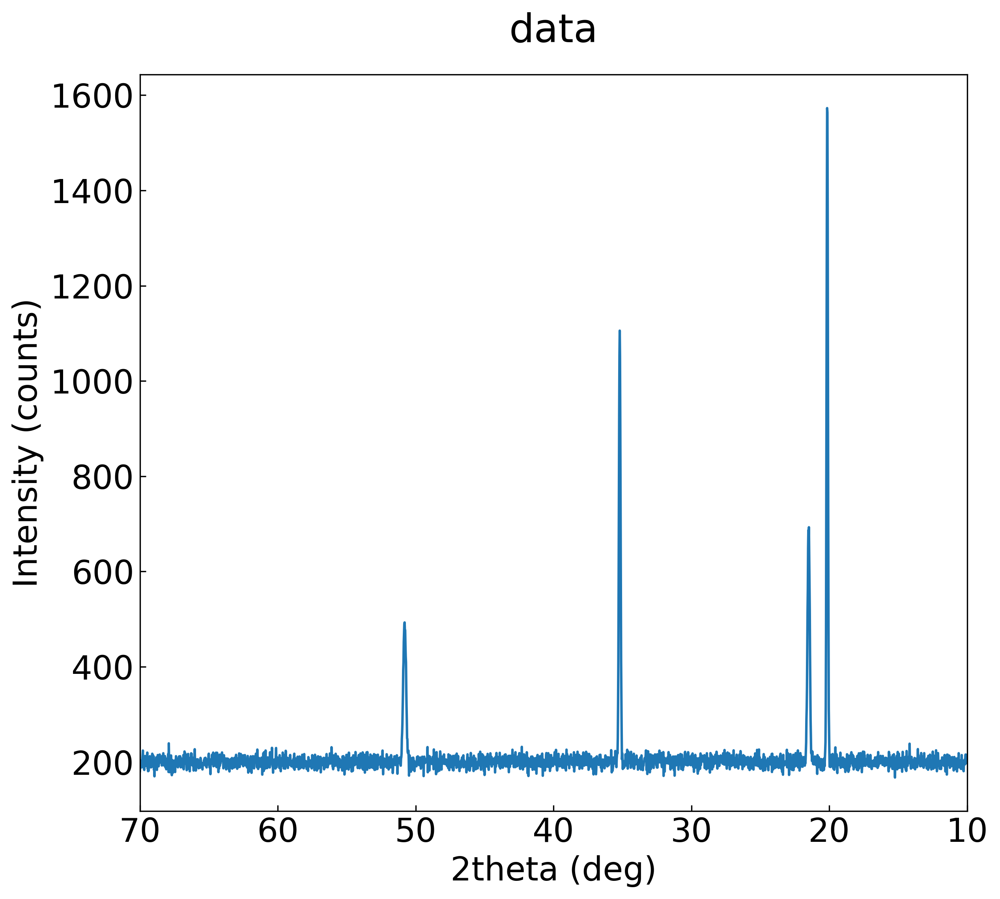
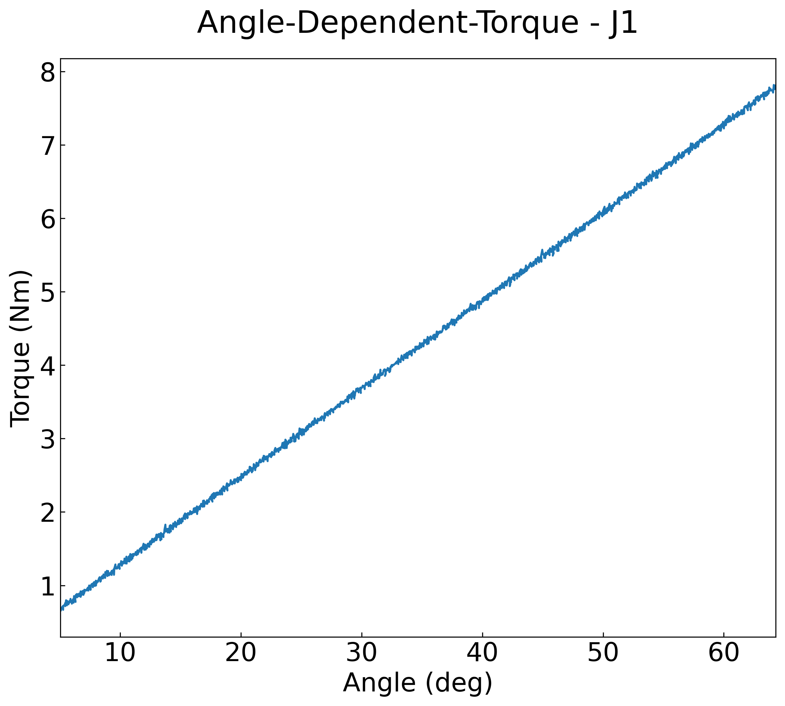
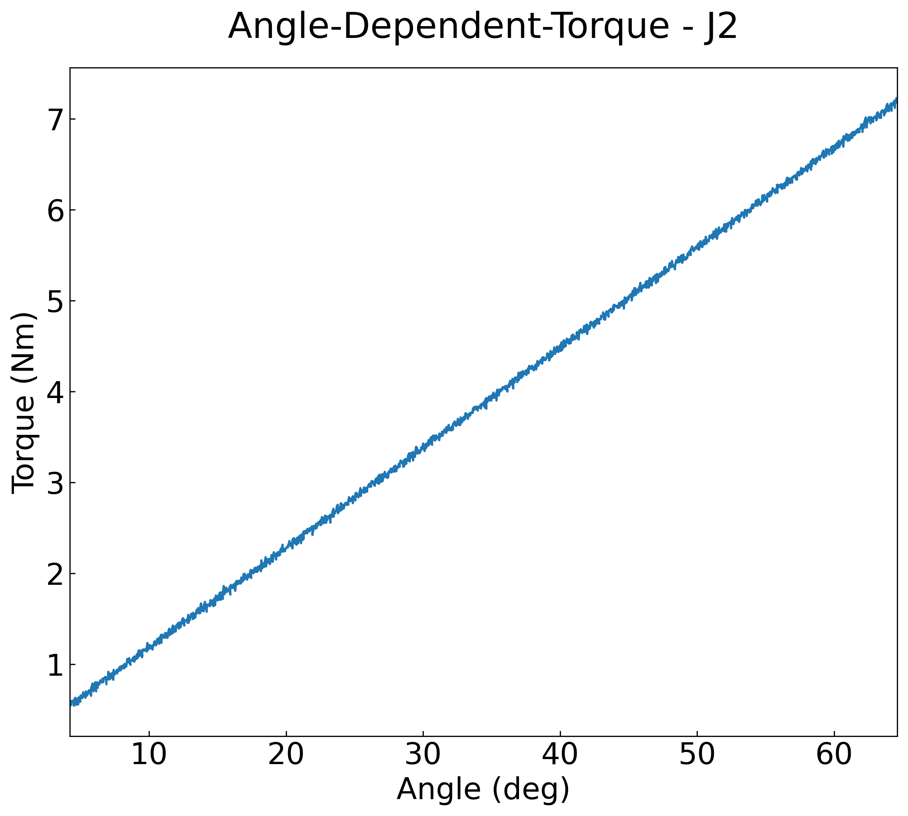
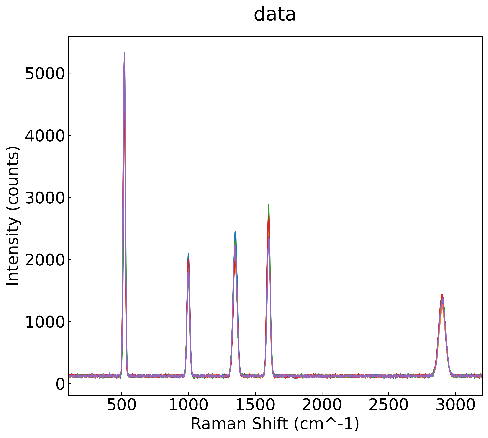
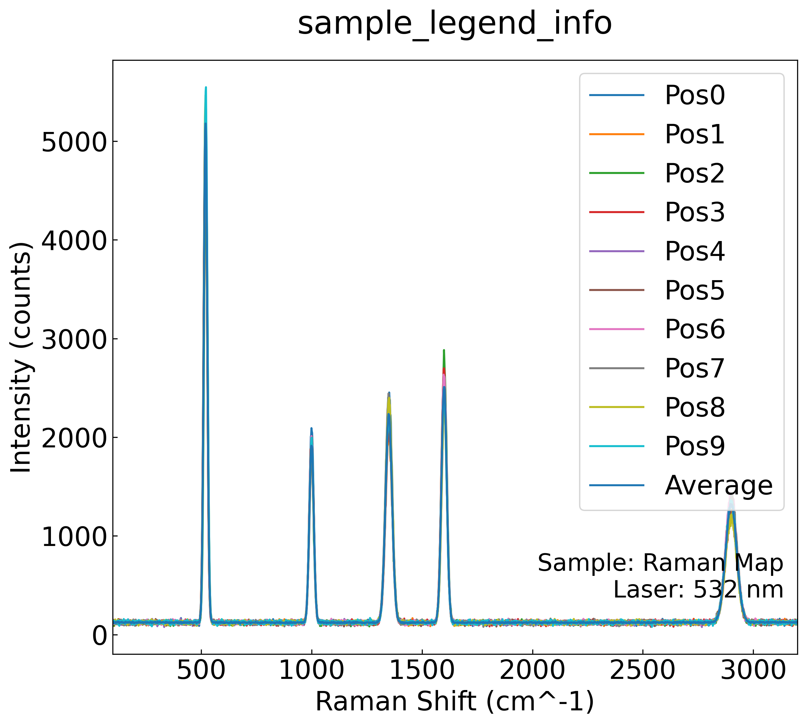
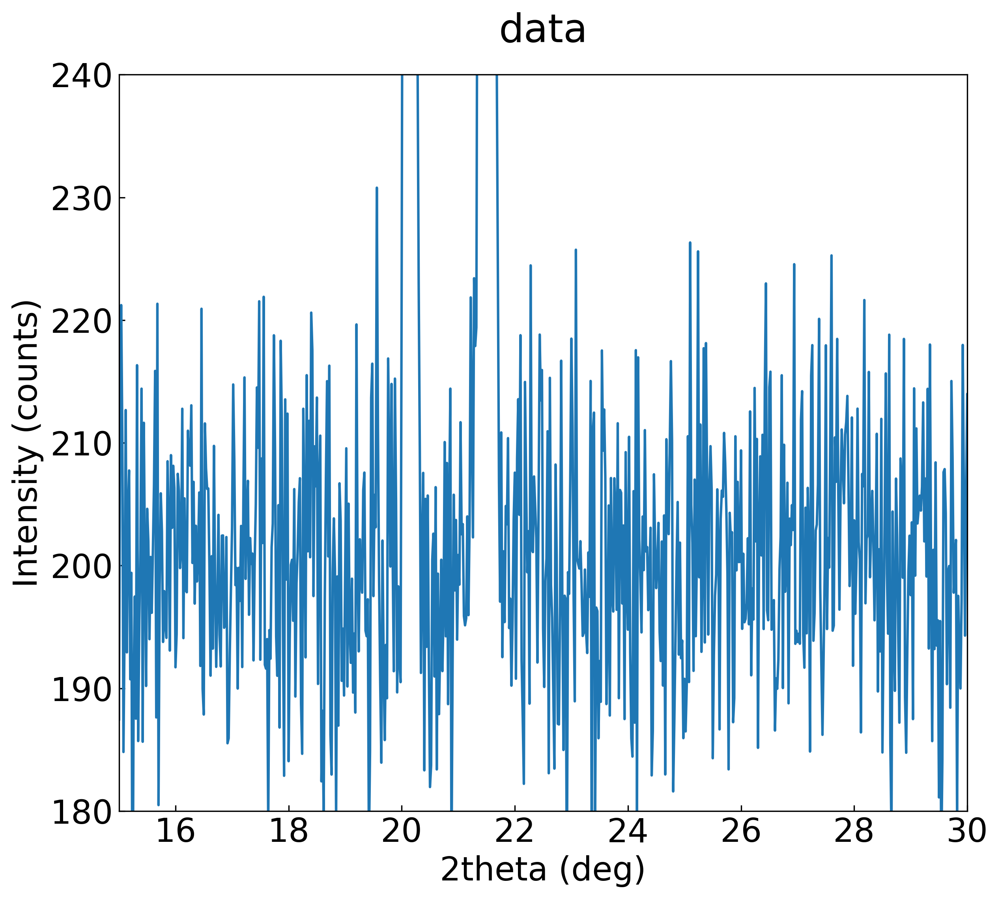

# csv2graph サンプル集

`csv2graph` の主なオプションを実際のデータと合わせて確認できるサンプル集です。各セクションに記載されたコマンドは、サンプルのディレクトリ構成を再現するとそのまま実行できます。

各サンプルの CSV はこのページから直接ダウンロードできます。必要に応じて生成済み画像やスクリプトも合わせて公開しています。

## サンプル1: オーバーレイのみ生成する基本例

XRDのデータを使って `--no-individual` で代表グラフだけを出力する最小構成のサンプルです。

### データの概要

以下のデータを使用します。XRDのデータを想定しています。

```bash
2theta (deg),Intensity (counts)
10.0,204.9671
10.02,198.6174
10.04,206.4769
10.06,215.2303
10.08,197.6585
10.1,197.6586
10.12,215.7921
10.14,207.6743
...
```

- [data.csv](./csv2graph_samples/sample1/data.csv)

=== "生成グラフ"
    { width="700" }

### ディレクトリ構造

```bash
sample1/
├── data.csv
├── data.png
└── sample.py
```

### 実行例

以下のタブで Python と CLI の実行例を切り替えられます。

=== "Python"
    ```python
    #sample.py
    from pathlib import Path

    from rdetoolkit.graph.api import csv2graph

    if __name__ == "__main__":
        csv2graph(
            csv_path=Path("sample1/data.csv"),
            no_individual=True,  # --no-individual
        )
    ```

=== "CLI"
  ```bash
  rdetoolkit csv2graph 'sample1/data.csv' --no-individual
  ```

### オプションの説明

- `no_individual=True`, `--no-individual` : 個別グラフは作らずオーバーレイ画像だけを作成します。

## サンプル2: Y 軸を対数表示する

XRD 想定データを `--logy` で対数スケール表示し、タイトルを指定するサンプルです。

### データの概要

以下のデータを使用します。ダイオードのI–V特性のデータを想定しています。

```bash
Voltage (V),Current (A)
0.0,9.999999999999999e-19
0.0008008008008008008,1.735937164947776e-14
0.0016016016016016017,3.5020091083020285e-14
...
```

=== "生成 グラフ"
    { width="700" }

- [data.csv](./csv2graph_samples/sample2/data.csv)

### ディレクトリ構造

```bash
sample2/
├── data.csv
└── sample_log_scale.py
```

### 実行例

以下のタブで Python と CLI の実行例を切り替えられます。

=== "Python"
    ```python
    # sample_log_scale.py
    from pathlib import Path

    from rdetoolkit.graph.api import csv2graph

    if __name__ == "__main__":
        csv2graph(
            csv_path=Path("sample2/data.csv"),
            logy=True,
            title="I–V_Curve_of_a_Diode_(log scale)",
        )
    ```

=== "CLI"
    ```bash
    rdetoolkit csv2graph sample2/data.csv \
      --logy \
      --no-individual \
      --title "I–V_Curve_of_a_Diode_(log scale)"
    ```

### オプションの説明

- `no_individual=True`, `--no-individual` : 個別グラフは作らずオーバーレイ画像だけを作成します。
- `--logy` / `logy=True`: Y 軸を対数スケールで描画します。

> 今回はサンプルとして存在しませんが、X軸を対数スケールで描画する時は、`--logx` / `logx=True`を使用します。

## サンプル3: 軸反転（X/Y）

XRD データを使い、`--invert-x` や `--invert-y` で軸を反転する使い方をまとめています。

### データの概要

以下のデータを使用します。XRDのデータを想定しています。

```bash
2theta (deg),Intensity (counts)
10.0,204.9671
10.02,198.6174
10.04,206.4769
10.06,215.2303
10.08,197.6585
10.1,197.6586
10.12,215.7921
10.14,207.6743
...
```

- [data.csv](./csv2graph_samples/sample3/data.csv)

=== "生成 グラフ"
    { width="700" }

### ディレクトリ構成

実行前のディレクトリ構成

```bash
sample3/
├── data.csv
└── sample_invert.py
```

### X軸を反転させる例

以下のタブで Python と CLI の実行例を切り替えられます。

=== "Python"
    ```python
    # sample_invert.py
    from pathlib import Path

    from rdetoolkit.graph.api import csv2graph

    if __name__ == "__main__":
        # invert_x
        csv2graph(
            csv_path=Path("sample3/data.csv"),
            invert_x=True,  # --invert-x
            no_individual=True,  # --no-individual
        )
    ```

=== "CLI"
    ```bash
    rdetoolkit csv2graph 'sample3/data.csv' --invert-x --no-individual
    ```

#### Y軸を反転させる例

=== "Python"
    ```python
    # sample_invert.py
    from pathlib import Path
    from rdetoolkit.graph.api import csv2graph

    if __name__ == "__main__":
        # invert_y
        csv2graph(
            csv_path=Path("sample3/data.csv"),
            invert_y=True,  # --invert-y
            no_individual=True,
        )
    ```

=== "CLI"
    ```bash
    rdetoolkit csv2graph 'sample3/data.csv' --invert-y --no-individual
    ```

### オプションの説明

- `invert_x=True`, `--invert-x` : 出力画像の X 軸は左右反転します。
- `invert_y=True`, `--invert-y` : 出力画像の Y 軸は上下反転します。
- `no_individual=True` : 個別グラフは作らずオーバーレイ画像だけを作成します。

## サンプル4: 複数ペアの系列をオーバーレイ

3 関節トルクのデータを複数ペアの X/Y 列で描画し、オーバーレイと個別グラフをまとめて出力します。

### データの概要

以下のデータを使用します。3関節（J1–J3）の角度・角速度・トルクを、ほぼ単調増加の角度と線形モデル＋微小ノイズで生成した合成時系列データです。

```bash
Phase-U:volt(V),Phase-U:curr(A),Phase-U:power(kW),Phase-V:volt(V),Phase-V:curr(A),Phase-V:power(kW),Phase-W:volt(V),Phase-W:curr(A),Phase-W:power(kW)
230.1,10.02,2.126,231.0,10.11,2.116,229.7,10.15,2.13
230.1,9.94,2.109,231.1,10.26,2.138,229.8,10.06,2.118
230.2,9.83,2.077,231.0,10.09,2.096,229.3,10.05,2.075
230.4,10.14,2.161,231.0,10.27,2.135,229.4,10.27,2.176
...
```

- [data.csv](./csv2graph_samples/sample4/data.csv)

=== "生成グラフ"
    { width="700" }

=== "個別グラフ1"
    { width="700" }

=== "個別グラフ2"
    { width="700" }

=== "個別グラフ3"
    { width="700" }

### ディレクトリ構成

実行前のディレクトリ構成

```bash
sample4/
├── data.csv
└── sample_pair_plot.py
```

### 実行例

以下のタブで Python と CLI の実行例を切り替えられます。

=== "Python"
    ```python
    # sample_pair_plot.py
    from pathlib import Path

    from rdetoolkit.graph.api import csv2graph

    if __name__ == "__main__":
        csv2graph(
            csv_path=Path("sample4/data.csv"),
            mode="overlay",
            x_col=[1, 4, 7],
            y_cols=[0, 3, 6],
            title="Angle-Dependent-Torque",
        )
    ```

=== "CLI"
    ```bash
    rdetoolkit csv2graph sample4/data.csv \
        --mode overlay \
        --x-col 1 --x-col 4 --x-col 7 \
        --y-cols 0 --y-cols 3 --y-cols 6 \
        --title "Angle-Dependent-Torque"
    ```

### オプションの説明

- `--mode overlay`: 全系列を1枚のグラフに重ねるモード（x1y1x2y2 相当）を選択します。
- `  --x-col 1 --x-col 4 --x-col 7`: X 軸に使う列を3つ指定します（0始まりで 2 列目、5 列目、8 列目）。以下のy列と順番にペアリングされます。
- `--y-cols 0 --y-cols 3 --y-cols 6`: Y 軸に使う列を3つ指定します（1 列目、4 列目、7 列目）。それぞれx列とペアになり、3本の系列として描画されます。
- `--title "Angle-Dependent Torque"`: 生成されるグラフのタイトルと出力ファイル名の基礎名を "Angle-Dependent Torque" に設定します。

## サンプル5: 単一の X 列と複数 Y 系列

ラマン分光データで 1 本の X 列と複数 Y 系列を組み合わせ、タイトルを変更する例です。

### データの概要

以下のデータを使用します。ラマン分光のダミーデータを想定しています。横軸 `Raman Shift (cm⁻¹)` に対して、`Pos0～Pos10` の各測定位置での `Intensity (counts)`（スペクトル強度）を並べています。

```bash
Raman Shift (cm^-1),Pos0: Intensity (counts),Pos1: Intensity (counts),Pos2: Intensity (counts),Pos3: Intensity (counts),Pos4: Intensity (counts),Pos5: Intensity (counts),Pos6: Intensity (counts),Pos7: Intensity (counts),Pos8: Intensity (counts),Pos9: Intensity (counts),Average: Intensity (counts)
100.0,117.0,124.0,134.0,135.0,111.0,126.0,132.0,116.0,126.0,114.0,124.0
101.551,117.0,126.0,106.0,138.0,110.0,127.0,134.0,146.0,134.0,116.0,125.0
103.102,126.0,139.0,110.0,150.0,119.0,134.0,128.0,128.0,116.0,141.0,129.0
104.652,100.0,108.0,90.0,119.0,118.0,145.0,106.0,117.0,144.0,117.0,116.0
106.203,102.0,87.0,114.0,125.0,117.0,108.0,112.0,117.0,133.0,136.0,115.0
...
```

- [data.csv](./csv2graph_samples/sample5/data.csv)

=== "Overlay グラフ"
    { width="700" }

### ディレクトリ構成

実行前のディレクトリ構成

```bash
sample5/
├── data.csv
└── sample_custom_title.py
```

### 実行例

以下のタブで Python と CLI の実行例を切り替えられます。

=== "Python"
    ```python
    # sample_custom_title.py
    from pathlib import Path

    from rdetoolkit.graph.api import csv2graph

    if __name__ == "__main__":
        csv2graph(
            csv_path=Path("sample5/data.csv"),
            mode="overlay",
            x_col=[1, 4, 7],
            y_cols=[0, 3, 6],
            title="Angle-Dependent-Torque",
        )
    ```

=== "CLI"
    ```bash
    rdetoolkit csv2graph sample5/data.csv \
      --x-col 0 \
      --y-cols 1 --y-cols 2 --y-cols 3 --y-cols 4 --y-cols 5 \
      --no-individual
      --title "Angle-Dependent-Torque"
    ```

### オプションの説明

- `--x-col 0`：X 軸用の列。ひとつ指定すれば、後続の Y 列すべてと自動でペアリングされます。
- `--y-cols 1 … 5`：描画したい Y 系列（5 列）を 0 始まりで列番号指定。
- `--no-individual`：統合プロットだけを出力。個別 PNG の生成を抑止します。
- `--title`: カスタムグラフタイトル

## サンプル6: 凡例表示件数を制限

ラマン分光データで `--max-legend-items` により凡例の表示件数を抑えるサンプルです。

### データの概要

以下のデータを使用します。ラマン分光のダミーデータを想定しています。横軸 `Raman Shift (cm⁻¹)` に対して、`Pos0～Pos10` の各測定位置での `Intensity (counts)`（スペクトル強度）を並べています。

```
Raman Shift (cm^-1),Pos0: Intensity (counts),Pos1: Intensity (counts),Pos2: Intensity (counts),Pos3: Intensity (counts),Pos4: Intensity (counts),Pos5: Intensity (counts),Pos6: Intensity (counts),Pos7: Intensity (counts),Pos8: Intensity (counts),Pos9: Intensity (counts),Average: Intensity (counts)
100.0,117.0,124.0,134.0,135.0,111.0,126.0,132.0,116.0,126.0,114.0,124.0
101.551,117.0,126.0,106.0,138.0,110.0,127.0,134.0,146.0,134.0,116.0,125.0
103.102,126.0,139.0,110.0,150.0,119.0,134.0,128.0,128.0,116.0,141.0,129.0
104.652,100.0,108.0,90.0,119.0,118.0,145.0,106.0,117.0,144.0,117.0,116.0
106.203,102.0,87.0,114.0,125.0,117.0,108.0,112.0,117.0,133.0,136.0,115.0
...
```

- [data.csv](./csv2graph_samples/sample6/data.csv)

=== "生成グラフ"
    { width="700" }

### ディレクトリ構成

実行前のディレクトリ構成

```bash
sample6/
├── data.csv
└── sample_max_legend_items.py
```

### 実行例

以下のタブで Python と CLI の実行例を切り替えられます。

=== "Python"
    ```python
    # sample_max_legend_items.py
    from pathlib import Path

    from rdetoolkit.graph.api import csv2graph

    if __name__ == "__main__":
        csv2graph(
            "sample6/data.csv",
            x_col=0,
            y_cols=[1, 2, 3, 4, 5],
            no_individual=True,
            max_legend_items=3,
        )
    ```

=== "CLI"
    ```bash
    rdetoolkit csv2graph sample6/data.csv \
      --x-col 0 \
      --y-cols 1 --y-cols 2 --y-cols 3 --y-cols 4 --y-cols 5 \
      --no-individual \
      --max-legend-items 3
    ```

### オプションの説明

- -`-x-col 0` は X 軸に 0 列目を使う指定。1 度だけ書けば後続のすべての Y 列と自動でペアになります。
- `--y-cols …` で 1〜5 列目の 5 系列を指定します。
- `--no-individual` で統合プロットの PNG のみ生成し、個別 PNG をスキップします。
- `--max-legend-items 3` で凡例の表示件数を 3 件までに制限します（超えると凡例が非表示になります）。

## サンプル7: 多チャンネル充放電データのオーバーレイ

充放電状態ラベルを複数列で扱い、方向列ごとに系列を色分けしながら `--output-dir` を切り替える高度な例です。

> サンプルには生成済み画像を含めていないため、出力例を得るにはコードを実行してください。

### データの概要

以下のデータを使用します。充放電特性のダミーデータを想定しています。

```
state_ch1,time_ch1[s],step_index_ch1,current_ch1[A],capacity_ch1[mAh],voltage_ch1[V],state_ch2,time_ch2[s],step_index_ch2,current_ch2[A],capacity_ch2[mAh],voltage_ch2[V],state_ch3,time_ch3[s],step_index_ch3,current_ch3[A],capacity_ch3[mAh],voltage_ch3[V],state_ch4,time_ch4[s],step_index_ch4,current_ch4[A],capacity_ch4[mAh],voltage_ch4[V],state_ch5,time_ch5[s],step_index_ch5,current_ch5[A],capacity_ch5[mAh],voltage_ch5[V],state_ch6,time_ch6[s],step_index_ch6,current_ch6[A],capacity_ch6[mAh],voltage_ch6[V]
Charge,0.0,1,1.0248357076505616,0.0,3.1464269673816196,Discharge,0.0,1,-0.9246489863932321,0.0,3.26398992423171,Discharge,0.0,1,-0.9703987550711959,0.0,3.301646178292083,Discharge,0.0,1,-0.8373920481516945,0.0,3.2405780651132403,Discharge,0.0,1,-1.0452295606856536,0.0,3.289520156004168,Discharge,0.0,1,-1.1267131011336096,0.0,3.2782242976855556
Charge,2.0,1,0.9930867849414408,0.5693531709169787,3.1401720080365,Discharge,2.0,1,-0.9528697682537017,0.0,3.2612743372332664,Discharge,2.0,1,-1.079386898465995,0.0,3.3142719992060634,Discharge,2.0,1,-0.9061484473317185,0.0,3.2529616227280664,Discharge,2.0,1,-0.9533585647953902,0.0,3.2768224979535368,Discharge,2.0,1,-1.0899924167596289,0.0,3.27788892249149
...
```

- [data.csv](./csv2graph_samples/sample7/data.csv)


### 実行例

以下のタブで Python と CLI の実行例を切り替えられます。

=== "Python"
    ```python
    from pathlib import Path

    from rdetoolkit.graph.api import csv2graph

    if __name__ == "__main__":
        csv2graph(
            Path("sample7/data.csv"),
            x_col=[1, 7, 13, 19, 25, 31],
            y_cols=[5, 11, 17, 23, 29, 35],
            direction_cols=[0, 6, 12, 18, 24, 30],
            max_legend_items=5,
            title="Charge_Rest_Discharge",
            output_dir=Path("./custom_output"),
        )
    ```

=== "CLI"
    ```bash
    rdetoolkit csv2graph sample7/data.csv \
      --x-col 1 --x-col 7 --x-col 13 --x-col 19 --x-col 25 --x-col 31 \
      --y-cols 5 --y-cols 11 --y-cols 17 --y-cols 23 --y-cols 29 --y-cols 35 \
      --direction-cols 0 --direction-cols 6 --direction-cols 12 \
      --direction-cols 18 --direction-cols 24 --direction-cols 30 \
      --logx --logy --max-legend-items 5 \
      --title "Charge_Rest_Discharge" \
      --output-dir ./custom_output
    ```

### オプションの説明

- `--output-dir ./custom_output`
  - 生成した PNG/HTML を保存するディレクトリ。指定がないと入力 CSV と同じフォルダになりますが、ここでは ./output にまとめて出力します。
- `--title "Charge_Rest_Discharge"`
  - グラフのタイトルと、出力ファイル名のベース（"Charge_Rest_Discharge.png など）を設定します。
- `--mode overlay`
  - すべての系列を 1 枚に重ね描きするモード。旧 CLI の x1y1x2y2 と同じで、複数の X/Y 列を一対一にペアリングします。
- `--x-col 1` `--x-col 7 … 43`
  - 横軸に使う列番号を列挙します（0 始まり）。ここでは 8 本の系列があり、列 1,7,13,…,43 がそれぞれの X 軸として使われます。CLI ではオプションを列数ぶん繰り返して
  指定します。
- `--y-cols 5 --y-cols 11 … 47`
  - 縦軸に使う列番号。X と同じ順番で 8 本指定し、列 5,11,17,…,47 を Y 系列として描画します。x_col と y_cols は位置対応でペアになります。
- `--direction-cols 0`, `--direction-cols 6 … 42`
  - 各 Y 系列に対応する「方向」列を指定します。列 0,6,12,…,42 には例えば Charge / Discharge などの状態ラベルが入っている想定で、その値ごとに線色を変えたり、セグ
  メントを分けたりします。系列ごとに違う方向列を指定したい場合は、Y 系列と同じ回数このオプションを繰り返します。
- `--max-legend-items 5`
  - 凡例に表示する項目数の上限。方向や系列が多い場合、6 件目以降の凡例を自動的に非表示にしてプロットを読みやすくします。

## サンプル8: 凡例の横に補足情報を表示

`--legend-info` で凡例付近にメタ情報を追記するラマン分光データの例です。

### データの概要

ラマン分光のダミーデータを想定しています。横軸 `Raman Shift (cm⁻¹)` に対して、`Pos0～Pos10` の各測定位置での `Intensity (counts)`（スペクトル強度）を並べています。

```
Raman Shift (cm^-1),Pos0: Intensity (counts),Pos1: Intensity (counts),Pos2: Intensity (counts),Pos3: Intensity (counts),Pos4: Intensity (counts),Pos5: Intensity (counts),Pos6: Intensity (counts),Pos7: Intensity (counts),Pos8: Intensity (counts),Pos9: Intensity (counts),Average: Intensity (counts)
100.0,117.0,124.0,134.0,135.0,111.0,126.0,132.0,116.0,126.0,114.0,124.0
101.551,117.0,126.0,106.0,138.0,110.0,127.0,134.0,146.0,134.0,116.0,125.0
103.102,126.0,139.0,110.0,150.0,119.0,134.0,128.0,128.0,116.0,141.0,129.0
104.652,100.0,108.0,90.0,119.0,118.0,145.0,106.0,117.0,144.0,117.0,116.0
106.203,102.0,87.0,114.0,125.0,117.0,108.0,112.0,117.0,133.0,136.0,115.0
...
```

- [data.csv](./csv2graph_samples/sample8/data.csv)

=== "生成グラフ"
    { width="700" }

### ディレクトリ構成

実行前のディレクトリ構成

```bash
sample8/
├── data.csv
└── sample_legend_info.py
```

### 実行例

=== "Python"
    ```python
    # sample_legend_info.py
    from pathlib import Path
    from rdetoolkit.graph.api import csv2graph

    if __name__ == "__main__":
        csv2graph(
            csv_path=Path("sample8/data.csv"),
            title="sample_legend_info",
            legend_info="Sample: Raman Map\nLaser: 532 nm",
            no_individual=True,
        )
    ```

=== "CLI"
    ```bash
    rdetoolkit csv2graph sample8/data.csv \
      --title "sample_legend_info" \
      --legend-info "Sample: Raman Map\nLaser: 532 nm" \
      --no-individual
    ```

### オプションの説明
- `legend_info`: 凡例枠の近く（もしくは右上）に任意テキストを追記します。複数行は `\n` で改行できます。
- `no_individual=True`: オーバーレイ画像のみを生成し、個別プロットを省略します。

## サンプル9: グリッド線の表示

XRD データで `--grid` を有効にし、読み取りやすさを高めるサンプルです。

### データの概要

サンプル:XRD 強度データを使って、グリッド線表示オプションを紹介します。

```csv
2theta (deg),Intensity (counts)
10.0,204.9671
10.02,198.6174
...
```

- [data.csv](./csv2graph_samples/sample9/data.csv)

=== "生成グラフ"
    { width="700" }

### ディレクトリ構成

実行前のディレクトリ構成

```bash
sample9/
├── cmd.md
├── data.csv
└── sample_grid.py
```

### 実行例

=== "Python"
    ```python
    # sample_grid.py
    from pathlib import Path
    from rdetoolkit.graph.api import csv2graph

    if __name__ == "__main__":
        csv2graph(
            csv_path=Path("sample9/data.csv"),
            grid=True,                # --grid
            no_individual=True,
        )
    ```

=== "CLI"
    ```bash
    rdetoolkit csv2graph sample9/data.csv \
      --grid \
      --no-individual
    ```

### オプションの説明

- `grid=True`, `--grid` : プロットに縦横のグリッド線を表示します。ピーク位置や値の読み取りがしやすくなります。
- `no_individual=True` : 個別グラフを出力せず、オーバーレイ画像のみ生成します。

## サンプル10: 表示範囲を絞り込む (xlim/ylim)

XRD データで `--xlim` と `--ylim` を指定してピーク付近だけを拡大する例です。

### データの概要

サンプル:XRD 強度データを使って、表示範囲を `--xlim` / `--ylim` で絞り込む方法を紹介します。

```csv
2theta (deg),Intensity (counts)
10.0,204.9671
10.02,198.6174
...
```

- [data.csv](./csv2graph_samples/sample10/data.csv)

=== "生成グラフ"
    { width="700" }

### ディレクトリ構成

実行前のディレクトリ構成

```bash
sample10/
├── cmd.md
├── data.csv
└── sample_lim.py
```

### 実行例

=== "Python"
    ```python
    # sample_lim.py
    from pathlib import Path
    from rdetoolkit.graph.api import csv2graph

    if __name__ == "__main__":
        csv2graph(
            csv_path=Path("sample10/data.csv"),
            xlim=(15, 30),     # --xlim 15 30
            ylim=(180, 240),   # --ylim 180 240
            no_individual=True,
        )
    ```

=== "CLI"
    ```bash
    rdetoolkit csv2graph sample10/data.csv \
      --xlim 15 30 \
      --ylim 180 240 \
      --no-individual
    ```

### オプションの説明

- `--xlim <min> <max>`, `xlim=(<min>, <max>)` : X 軸の表示範囲を指定します（単位は CSV の X 列と同じ）。例では 15°〜30° の 2θ のみを表示。
- `--ylim <min> <max>`, `ylim=(<min>, <max>)` : Y 軸の表示範囲を指定します（単位は縦軸の列と同じ）。例では 180〜240 counts の強度のみを表示。
- `--no-individual` : 個別グラフを生成せず、オーバーレイ画像のみ出力します。

表示範囲を絞ることで、ピーク付近の詳細を拡大表示したり、ノイズを除いた視認性を高めたりできます。

## サンプル11: 代表画像と個別画像の出力先を分ける

`--main-image-dir` と `--output-dir` を使って、代表画像と個別画像を別フォルダに保存する例です。

### データの概要

サンプル:XRD 強度データを使って、代表画像と個別画像を別ディレクトリに保存する方法を紹介します。

```csv
2theta (deg),Intensity (counts)
10.0,204.9671
10.02,198.6174
...
```

- [data.csv](./csv2graph_samples/sample11/data.csv)

=== "代表グラフ"
    { width="700" }

=== "個別グラフ"
    .png){ width="700" }

### ディレクトリ構成

```bash
$ ls -l sample11/
total 472
-rw-r--r--@ 1 user  staff  44132 10 26 23:33 data.csv
-rw-r--r--@ 1 user  staff    290 10 27 12:46 switch_output_directory.py
```

### 実行例

=== "Python"
    ```python
    # sample11/switch_output_directory.py
    from pathlib import Path
    from rdetoolkit.graph.api import csv2graph

    if __name__ == "__main__":
        csv2graph(
            csv_path=Path("sample11/data.csv"),
            main_image_dir=Path("sample11/main_image"),   # --main-image-dir
            output_dir=Path("sample11/other_image"),      # --output-dir
        )
    ```

=== "CLI"
    ```bash
    rdetoolkit csv2graph sample11/data.csv \
      --main-image-dir sample11/main_image \
      --output-dir sample11/other_image
    ```

### 実行結果と出力ファイル構成

```bash
sample11/
├── data.csv
├── main_image # 代表画像出力ディレクトリ
│   └── data.png
├── other_image # 個別画像出力ディレクトリ
│   └── data_intensity_(counts).png
└── switch_output_directory.py
```

### オプションの説明

- `--main-image-dir` : オーバーレイ画像を保存するディレクトリを指定します。デフォルトでは `--output-dir` と同じ場所になります。
- `--output-dir` : 個別プロット（系列ごとの PNG）や HTML 出力を保存するディレクトリを指定します。指定がない場合は入力 CSV と同じフォルダに作成されます。

代表画像と個別画像を別フォルダに分けることで、レポート用の代表図と解析用の細かい図を整理しやすくなります。

## サンプル12: Plotly HTML 出力を有効化

`--html` でインタラクティブな Plotly HTML を生成するサンプルです。

### データの概要

サンプル:XRD 強度データを使って、Plotly によるインタラクティブ HTML を有効にする `--html` オプションを紹介します。

```csv
2theta (deg),Intensity (counts)
10.0,204.9671
10.02,198.6174
...
```

- [data.csv](./csv2graph_samples/sample12/data.csv)

=== "個別グラフ"
    { width="700" }

### ディレクトリ構成

```bash
sample12/
├── data.csv
└── output_html.py
```

### 実行例

=== "Python"
    ```python
    from pathlib import Path
    from rdetoolkit.graph.api import csv2graph

    if __name__ == "__main__":
        csv2graph(
            csv_path=Path("sample12/data.csv"),
            html=True,                 # --html
            output_dir=Path("plots"),
            no_individual=True,
        )
    ```

=== "CLI"
    ```bash
    rdetoolkit csv2graph sample12/data.csv \
      --html \
      --no-individual
    ```

### 実行後ディレクトリ

```bash
sample12/
├── data.csv
├── data.html # 生成
├── data.png # 生成
└── output_html.py
```

### オプションの説明

- `--html` : Plotly を使ったインタラクティブな HTML ファイル（`*.html`）を出力します。生成された HTML はブラウザで開き、マウス操作でズームやホバー表示が可能です。
- `--no-individual` : 個別プロットをスキップし、統合プロットのみ生成します（HTML も同じ出力先に保存されます）。

インタラクティブ出力を利用するには Plotly ライブラリがインストールされている必要があります。インストールされていないと、以下のようなエラーが出力されます。

```bash
ImportError: Plotly is required for HTML output but is not installed. Install it with: pip install plotly
🔥 Unexpected error: Plotly is required for HTML output but is not installed. Install it with: pip install plotly
Aborted!
```
